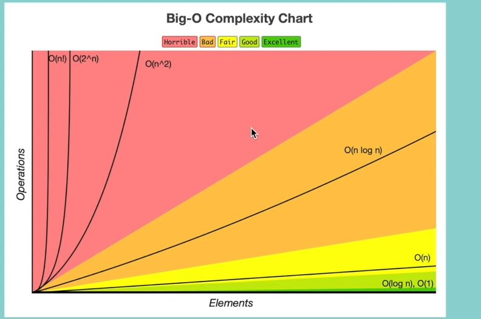

# <ins> Graph for O(N) complexity </ins> #

- **Out of the below which can converted to O(N) time complexity**
  
  - O(N+P) where P< N/2 &rarr; here N>P hence the `P` becomes the `non dominant` and hence cen be ignored
  - O(2N) &rarr; this can be converted to O(N) time complexity as  droping constant
  - O(N+logN) &rarr; from the `graph` we can see that `O(N) is dominant than O(logn)` hence the `O(N) can be kept`
  - O(N+NlogN) &rarr; from the `graph` we can see that `O(N) is non dominant than O(nlogn)` hence the `O(N) can be drop` but not the `O(NlogN)`
  - O(N+M) &rarr; here as n and m are different hence that can't be dropped