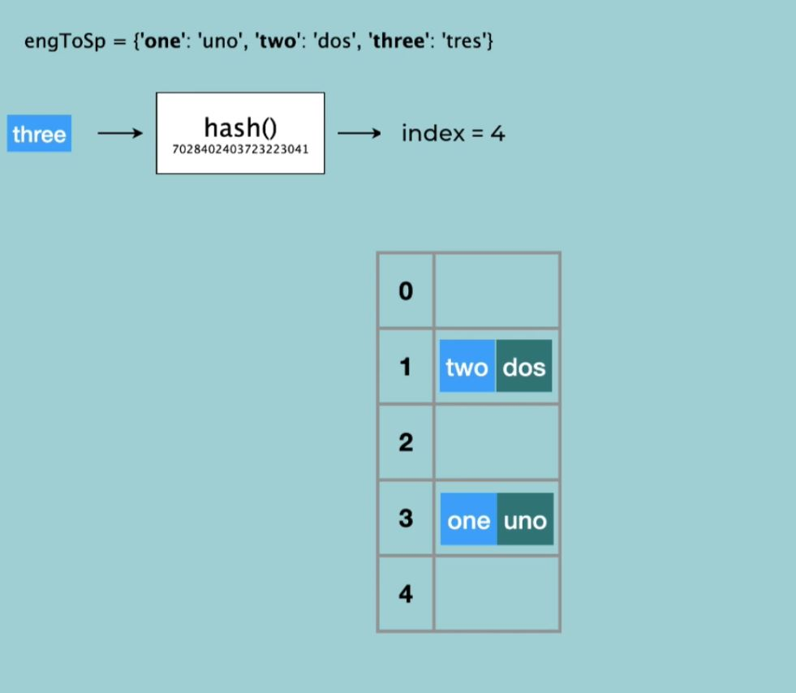
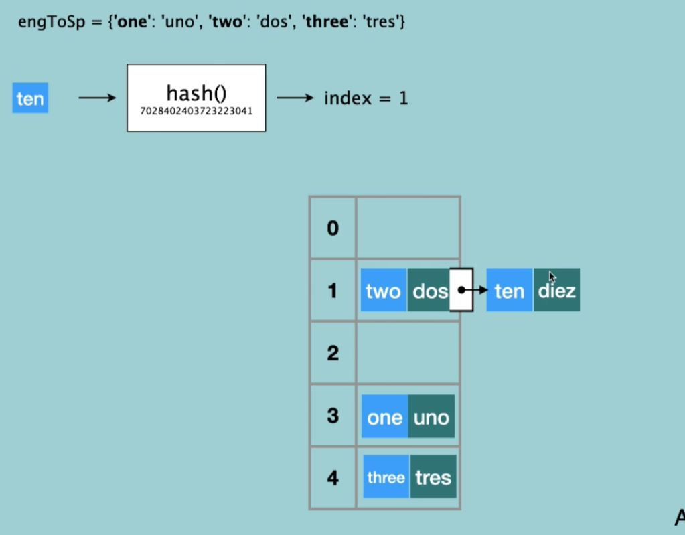

# <ins> Dictionary can be stored in Memory </ins> #

- in case of `collusion` where `for different key we have the same hash table value` then in that case `old key-value pair` will add the `new key-value pair` which has the `same index` as the `linked list`

